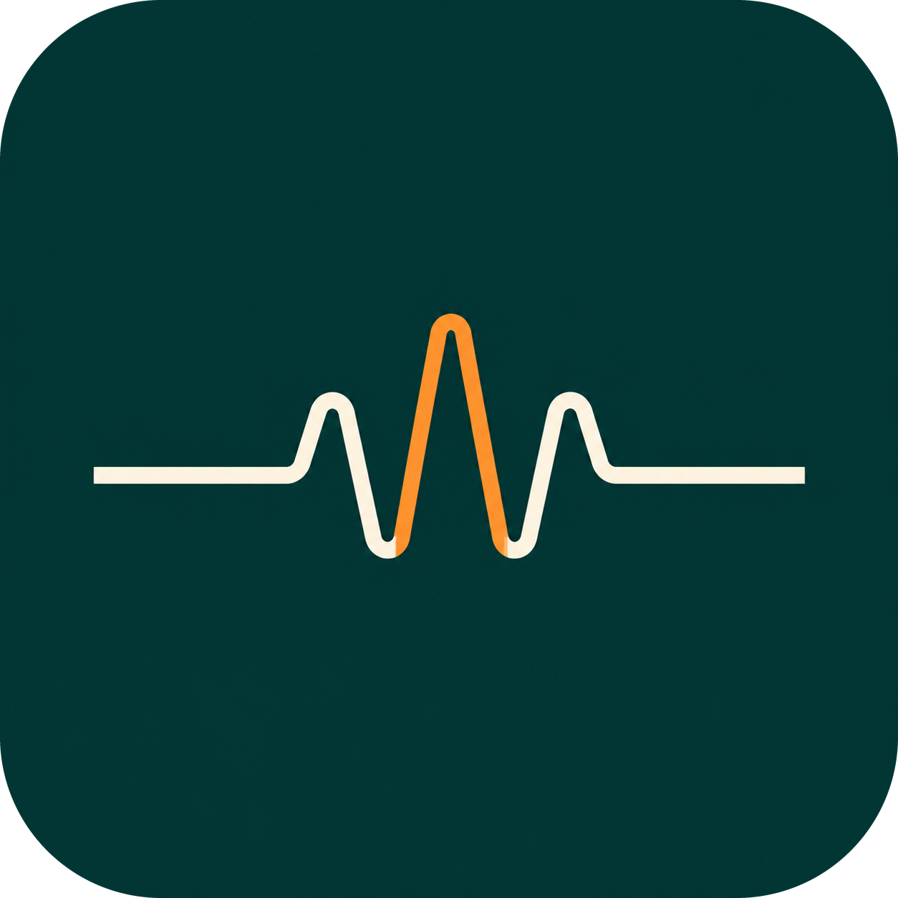

<div align="center">

  

  # Dialogue Reader

  **Reads on-screen game dialogue aloud, with a different voice per speaker.**

  
  
  
  
  [](https://github.com/Maxaubert/Dialogue-reader/commits)

  <br>

  <!-- tech-stack row (skill-icons): Python, PySide6 (Qt), Windows -->
  

</div>

<!-- DEMO GIF slot: record a short loop of Dialogue Reader speaking game dialogue, save it as
     assets/demo.gif, and uncomment the line below: -->
<!-- <p align="center"></p> -->

---

## What it does

<table>
<tr>
<th align="center" width="25%">Capture</th>
<th align="center" width="25%">OCR</th>
<th align="center" width="25%">Speakers</th>
<th align="center" width="25%">TTS</th>
</tr>
<tr>
<td valign="top">
<ul>
<li>Pick rectangles on screen</li>
<li>Polled at 12 Hz for pixel changes</li>
<li>Window or screen capture, zoom-stable when possible</li>
<li>Auto-pauses while Magnifier is zoomed</li>
</ul>
</td>
<td valign="top">
<ul>
<li>WinOCR for clean UI text</li>
<li>EasyOCR for stylized game fonts</li>
<li>Per-region engine choice (dialogue vs speaker name)</li>
<li>Cosmetic-jitter dedup so the same line is not re-spoken</li>
</ul>
</td>
<td valign="top">
<ul>
<li>One region for the speaker name, one for dialogue</li>
<li>Each character gets their own voice from the pool</li>
<li>Mappings persist in <code>speakers.json</code></li>
<li>Cycle voices live with a hotkey</li>
</ul>
</td>
<td valign="top">
<ul>
<li><b>Kokoro</b> 28 English voices</li>
<li><b>Piper</b> curated voice set</li>
<li><b>Sherpa</b> VCTK (109), LibriTTS-R (904), MeloTTS</li>
<li>Mix engines in one pool, change speed live</li>
</ul>
</td>
</tr>
</table>

---

## Quick start

```bash
pip install -r requirements.txt
```

Install [AutoHotkey v2](https://www.autohotkey.com/), then double-click `dialogue_reader.ahk`. It launches `main.py` as a child process and binds your hotkeys. Closing the AHK script terminates the Python process.

In game, use:

| Hotkey | What it does |
|---|---|
| `F1` | Pick a dialogue region |
| `Ctrl+F1` | Pick a speaker-name region |
| `Shift+F1` | Clear all regions |
| `End` | Pause or unpause |
| `PgUp` / `PgDn` | TTS speed up / down |
| `F2` / `Ctrl+F2` | Cycle the current speaker's voice forward / back |

Bindings live in `dialogue_reader.ini`. Right-click the tray icon and pick "Reload Script" to apply changes.

---

## Configuration

`dialogue_reader.ini` is the single source of truth:

| Section | What you set |
|---|---|
| `[Hotkeys]` | Which key triggers each command |
| `[OCR]` | Engine for dialogue and speaker regions (`winocr` / `easyocr`) |
| `[Capture]` | Capture mode (`auto`, `screen`, `window`) |
| `[Speakers]` | Voice-assignment strategy (`random`, `round_robin`, `inverse_round_robin`) |
| `[Magnifier]` | `SkipWhenZoomed`: pause polling while zoomed |
| `[Voices]` | Default voice and the pool. Supports `<engine>:all` and `sherpa:<model>:<a>-<b>` ranges |
| `[Polling]` | `TextConfirmPolls`: how many identical OCR polls before speaking |

---

## Layout

```
main.py             Main loop: poll regions, OCR, dedup, speak
capture.py          Region capture (mss / PrintWindow window-mode)
region_picker.py    Click-and-drag region selector (PySide6 overlay)
ocr.py              WinOCR and EasyOCR wrappers + worker thread
tts.py              TTS dispatcher (piper / kokoro / sherpa)
kokoro_tts.py       Kokoro-ONNX backend
sherpa_tts.py       Sherpa-ONNX backend (VCTK, LibriTTS-R, MeloTTS)
speakers.py         Speaker to voice mapping with persistence
magnifier.py        Detects when Windows Magnifier is zoomed in
command_server.py   UDP server on port 7849 listening for AHK commands
dialogue_reader.ahk Hotkey script and Python child process supervisor
dialogue_reader.ini All user settings
speakers.json       Persistent speaker to voice assignments
docs/voices/        Voice catalogs (CSV) for each engine
```
